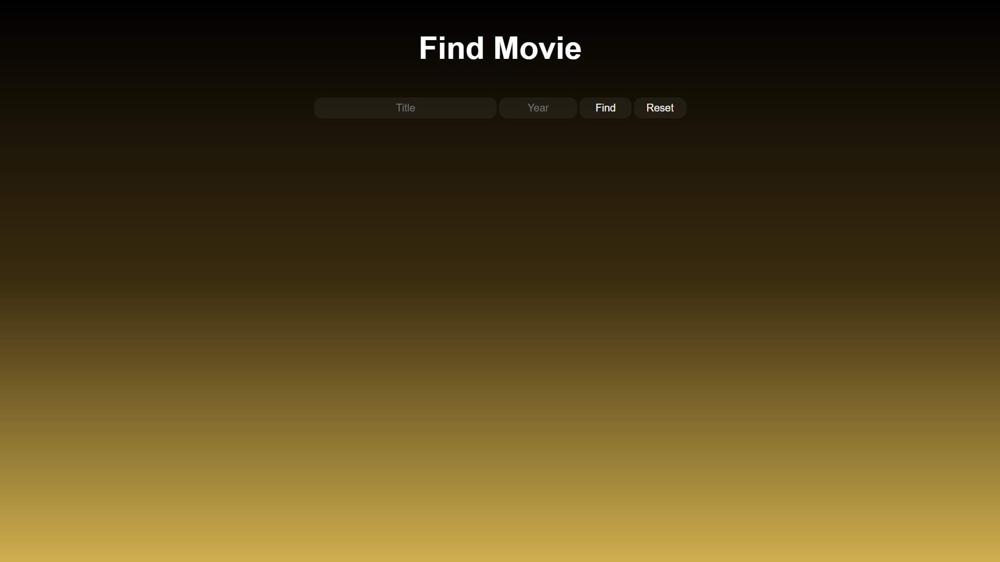

# 🎬 Find Movie

<div align="center">
  


### 🎯 A beautiful and simple application to search for movies using OMDb API



</div>

---

## ✨ Features

### Core Features
- 🎬 **Search movies** - By title and year
- 📝 **Movie details** - Title, Year, Released, Genre, Actors
- 🖼️ **Movie poster** - Display poster when available
- ⌨️ **Enter key support** - Press Enter to search quickly
- 🔄 **Auto-clean** - Input fields clear after search
- 🎯 **Smart validation** - Year field accepts only numbers

## 🚀 Quick Start

```bash
# Clone the repository
git clone https://github.com/yourusername/find-movie.git

# Navigate to project folder
cd find-movie

# Open index.html in your browser
open index.html  # Mac
start index.html # Windows
```

## 💻 Technologies Used


## 📁 Project Structure

```
find-movie/
├── 📄 index.html          # Main HTML file
├── 📄 style.css           # Styles and gradient design
├── 📄 script.js           # JavaScript functionality
├── 📄 README.md           # Documentation
│
└──  📁 screenshots/        # Screenshot images
    └── main.png
```

## 🎮 How It Works

### 1. Search for a movie
   - Enter movie title in the **Title** field
   - (Optional) Enter release year in the **Year** field
   - Click **Find** or press **Enter**

### 2. View movie information
   - **Poster** appears on the left
   - **Details** appear on the right:
     - Title
     - Year
     - Released date
     - Genre
     - Actors
     - IMDB Score

### 3. Reset
   - Click **Reset** to clear results

## 🤝 Contributing

1. 🍴 Fork the repository
2. 🌿 Create a feature branch (`git checkout -b feature/AmazingFeature`)
3. 💾 Commit your changes (`git commit -m 'Add some AmazingFeature'`)
4. 📤 Push to the branch (`git push origin feature/AmazingFeature`)
5. 🔍 Open a Pull Request

## 📞 Contact

<div align="center">
  
[](https://github.com/MrAvatar0)

</div>

## 📜 License

This project is licensed under the MIT License - see the [LICENSE](./LICENSE.txt) file for details.

---


<div align="center">
  
### ⭐ Star this project on GitHub — it helps!

**Made with ❤️ and JavaScript by [Avatar](https://github.com/MrAvatar0)**

[](https://forthebadge.com)
[](https://forthebadge.com)

</div>